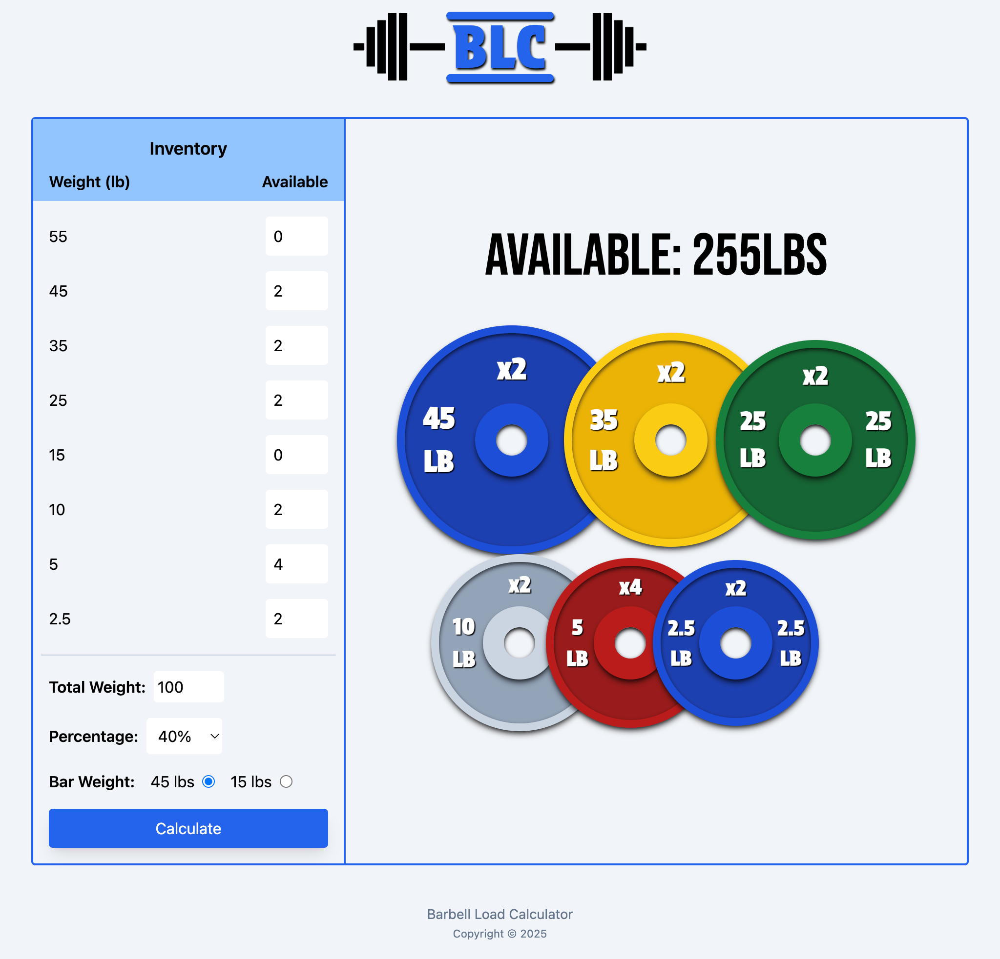

# Barbell Load Calculator

The Barbell Load Calculator _(BLC)_ is a web application designed to simplify the process of calculating weight plates for barbell exercises. Whether you're lifting heavy loads or aiming for precision with lighter weights, _BLC_ eliminates the mental math by dynamically calculating the exact weight plates required based on your inputs.

## Features

- **Customizable Plate Inventory**: Users can input the weight plates they have available, ensuring accurate calculations based on their personal setup.

- **Target Weight Calculation**: Input your desired total weight and bar weight, and the app will calculate the plates required.

- **Percentage-Based Lifting**: Calculate plates for a percentage of your total weight _(e.g., 85% of 225 lbs)_.

- **Responsive Design**: Optimized for mobile, tablet, and desktop users.

- **Local Storage Integration**: Saves user preferences and plate inventory for future sessions.

- **User Feedback**: Alerts and popovers provide guidance when inputs are invalid _(e.g., insufficient plates)_.

## How It Works

1. **Input Your Total Weight**: Enter the total weight you want to lift.

2. **Select Your Barbell Weight**: Choose between standard options _(e.g., 45 lbs, 15 lbs)_.

3. **Specify Available Plates**: Customize your inventory by entering the quantity of each plate you own.

4. **Calculate**: The app dynamically calculates the plates required and displays them in an easy-to-read format.

## Technologies Used

- **React**: Frontend framework for building dynamic and interactive user interfaces.

- **TypeScript**: Ensures type safety and maintainable code.

- **Tailwind CSS**: Utility-first CSS framework for responsive and clean design.

- **HTML Popover API**: Provides accessible and lightweight feedback to users.

- **Local Storage**: Persists user data between sessions.

### Links

- Live Site: [https://barbell-load-calculator.netlify.app/](https://barbell-load-calculator.netlify.app/)
